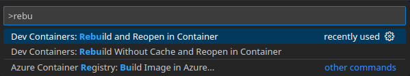

# latex-docker

[](https://hub.docker.com/r/rumexcrispp/latex-docker)
[](https://github.com/rumexcrisp/latex-docker/actions/workflows/build.yml)

A Docker-based LaTeX distribution with support for BibLaTeX and automatic compression.

## Prerequisites

It is assumed you already have the following packages installed. They area available for pretty much any OS.

- [Docker](https://docs.docker.com/engine/install/) or [Podman](https://podman.io/)
- [Visual Studio Code](https://code.visualstudio.com/)
  - [LaTeX Workshop Extension](https://marketplace.visualstudio.com/items?itemName=James-Yu.latex-workshop)

## Usage

This docker is intended to use as a remote container. Create your custom latex project folder and open in VSCode. Inside create a `.devcontainer` folder including a [`devcontainer.json`](.devcontainer/devcontainer.json) file.

Specify your project name, the image to use ([`rumexcrispp/latex-docker`](https://hub.docker.com/r/rumexcrispp/latex-docker)) and the necessary extension. 

```json
  "name": "latex-docker",
  "image" : "rumexcrispp/latex-docker:dev",
  "extensions": ["james-yu.latex-workshop"]
```

Open the VSCode command palette with <kbd>Ctrl</kbd> + <kbd>Alt</kbd> + <kbd>P</kbd> and run the command `Dev Containers: Rebuild and Reopen in Container`. See following screenshot.



Start editing your latex files. If you use the example [`devcontainer.json`](.devcontainer/devcontainer.json) file, the output PDF will also be compressed.

## Pull the Image Manually

Check out the [Docker Hub](https://hub.docker.com/r/rumexcrispp/latex-docker) page or pull it directly via:

```sh
docker pull rumexcrispp/latex-docker
```
